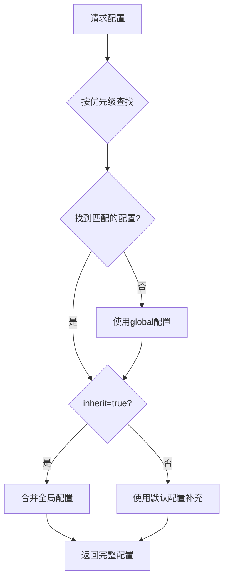
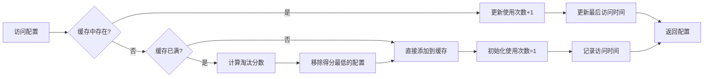
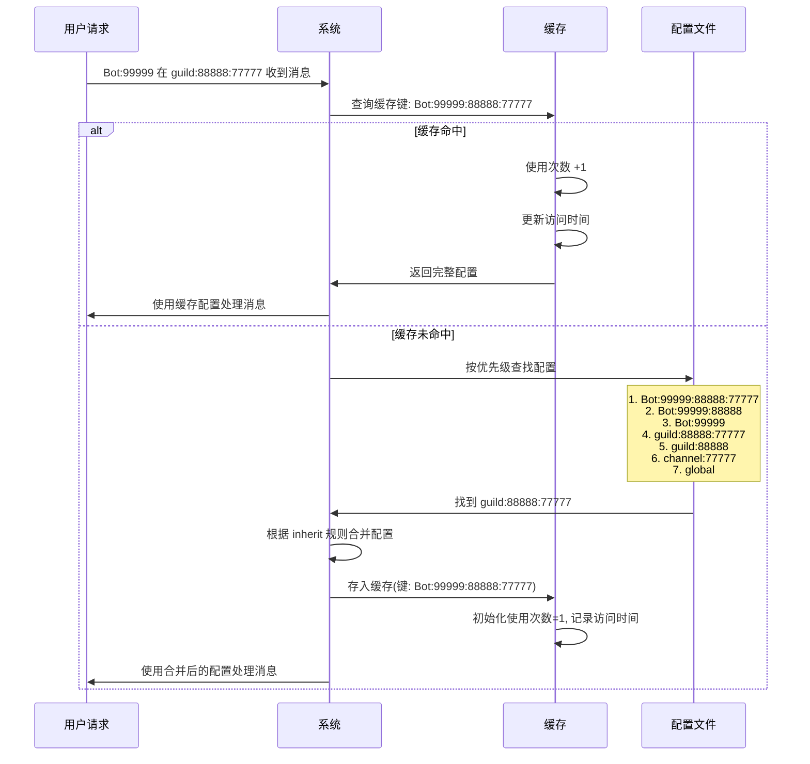

# karin 场景配置文档

> 版本: 2.0
> 推荐使用 WebUI 进行可视化配置管理

## 概述

Karin 采用灵活的配置系统，支持针对不同场景（群聊、频道、私聊等）进行精细化配置管理。每个场景使用独立的配置文件，支持继承机制和优先级覆盖。

### 配置文件列表

配置文件位于 `@karinjs/config/scene/` 目录下：

- `group.json`: 群聊场景配置
- `guild.json`: 频道场景配置
- `friend.json`: 好友私聊场景配置
- `direct.json`: 频道私聊场景配置

### 配置继承机制

每个配置文件都支持继承机制，通过 `inherit` 字段控制：

- **全局配置**: 在配置文件中可配置的 `global` 字段，作为该场景的基准配置
- **默认配置**: 硬编码在框架内部的兜底配置，不可修改，当配置缺失时自动使用
- **继承规则**:
  - `inherit: true`: 继承该场景的全局配置(`global`)，缺失的字段从全局配置中补充
  - `inherit: false`: 不继承全局配置，缺失的字段使用框架的默认配置补充



### 配置优先级

每个场景都有明确的配置优先级，系统会从高到低依次查找，找到第一个匹配的配置后停止：

**查找顺序**: 高优先级 → 中优先级 → 低优先级 → 全局配置 → 默认配置

例如在频道场景中：

```
Bot:99999:88888:77777 (优先级1)
  ↓ 未找到
Bot:99999:88888 (优先级2)
  ↓ 未找到
Bot:99999 (优先级3)
  ↓ 未找到
guild:88888:77777 (优先级4) ← 找到匹配！
  ↓ 根据inherit字段决定是否继承
global (全局配置)
  ↓ 如果inherit=false或字段仍缺失
框架默认配置 (兜底)
```

## 插件启用规则配置

> 适用于 `enable`、`disable` 字段的插件标识规则

### 插件标识方式

支持以下四种方式来标识插件：

1. **插件包名**: `karin-plugin-example`
   - 作用范围：整个插件包的所有插件
   - 使用场景：需要启用/禁用整个插件包时

2. **插件文件相对路径**: `karin-plugin-example/index.js`
   - 作用范围：指定文件中的所有插件
   - 使用场景：只针对某个插件文件进行配置
   - 注意：路径本身就是唯一标识，无需再指定插件包名

3. **插件名称**(需搭配文件路径): `karin-plugin-example/index.js:example`
   - 作用范围：指定文件中名称为 `example` 的插件
   - 使用场景：精确控制某个具名插件
   - 格式：`文件路径:插件名称`

### 示例说明

```json
{
  "enable": [
    "karin-plugin-core"  // 启用整个 core 插件包
  ],
  "disable": [
    "karin-plugin-example",  // 禁用整个 example 插件包
    "karin-plugin-test/index.js",  // 禁用 test 包下的 index.js 文件中的所有插件
    "karin-plugin-admin/user.js:userInfo",  // 禁用 admin 包下 user.js 文件中名为 userInfo 的插件
  ]
}
```

### 优先级说明

当同一个插件被多个规则匹配时，遵循以下优先级（从高到低）：

1. 插件类名 > 插件名称 > 文件路径 > 插件包名

例如：

```json
{
  "enable": ["karin-plugin-example"],  // 启用整个包
  "disable": ["karin-plugin-example/index.js:TestPlugin"]  // 但禁用特定类
}
```

结果：`karin-plugin-example` 包中除了 `TestPlugin` 类之外的所有插件都会被启用

## 键值配置

### 键(key)字段说明

- `Bot`: 固定前缀，用于标识机器人相关配置
- `self_id`: 机器人的唯一标识符(如QQ号、机器人账号ID等)
- `user_id`: 用户ID
- `group_id`: 群号ID
- `guild_id`: 频道ID
- `channel_id`: 子频道ID
- `default`: 全局配置
- `*`: 通配符，用于匹配所有对应层级的ID

**类型兼容性说明**:

配置中的用户ID、群ID等字段支持数字和字符串两种类型
当使用数字类型时，系统会自动将其转换为字符串。转换后长度大于0则视为有效值

示例(成员黑白名单配置)：

```json
{
  "global": {
    "member_disable": [
      "123456789",    // 字符串类型(推荐)
      987654321       // 数字类型，会自动转为 "987654321"
    ],
    "member_enable": [
      111222333,      // 数字类型，会自动转为 "111222333"
      "444555666"     // 字符串类型(推荐)
    ]
  }
}
```

### 值(value)字段说明

- `inherit`:
  - 类型: `boolean`
  - 说明: 是否继承全局配置
  - `true`: 继承全局配置
  - `false`: 使用默认配置进行补全，默认位置为硬编码，不可配置

- `cd`:
  - 类型: `number`
  - 说明: 机器人命令冷却时间，单位秒
  - 默认值: `0`

- `user_cd`:
  - 类型: `number`
  - 说明: 每个用户的多个命令冷却时间，单位秒，例如 `1s` 内只会响应一次命令
  - 默认值: `1`

- `mode`:
  - 类型: `number`
  - 说明: 机器人响应模式，不同场景支持的模式不同，详见各场景说明
  - 默认值: `0`

- `alias`:
  - 类型: `string[]`
  - 说明: 机器人命令别名列表
  - 默认值: `[]`
  - 支持使用正则表达式进行匹配
    - 正则: 使用`/`包裹正则表达式内容，例如 `[/小Q/i]`，表示不区分大小写匹配 `小Q`
    - 完全匹配: `["小Q"]`，表示完全匹配 `小Q` 前缀，仅可以通过 `小Q你在吗` 这种固定前缀来触发

- `enable`: 启用
- `disable`: 禁用
  - 类型: `string[]`
  - 说明: 启用/禁用插件列表，请参考上方的 [插件启用规则配置](#插件启用规则配置)
  - 默认值: `[]`

- `member_enable`: 白名单
- `member_disable`: 黑名单
  - 类型: `string[]`
  - 说明: 针对特定成员的单独黑白名单配置(仅群聊/频道场景)
  - 默认值: `[]`

## 场景配置

### 群聊

#### 键配置规则

> 以下规则优先级从高到低排列，优先级高的规则会覆盖优先级低的规则

- `Bot:self_id:group_id`: 指定某机器人在某群的配置
- `Bot:self_id`: 指定某机器人的全局配置
- `group:group_id`: 指定某群的配置
- `global`: 全局默认配置

**应答模式**(群聊):

- `0`: 回应所有消息
- `1`: 仅回应机器人主人的消息
- `2`: 仅回应机器人管理员的消息(包含主人)
- `3`: 仅回应包含at机器人的消息
- `4`: 仅回应 `alias(机器人别名)` 的消息
- `5`: 仅回应包含at机器人的消息或别名消息
- `6`: 非机器人主人仅回应at机器人消息，主人无限制
- `7`: 非机器人管理员仅回应at机器人消息，管理员无限制(包含主人)
- `8`: 非机器人主人仅回应别名消息，主人无限制
- `9`: 非机器人管理员仅回应别名消息，管理员无限制(包含主人)
- `10`: 非机器人主人仅回应别名消息或at机器人消息，主人无限制
- `11`: 非机器人管理员仅回应别名消息或at机器人消息，管理员无限制(包含主人)

<details>
<summary>示例1：指定机器人在特定群的配置</summary>

```json
{
  // 修改机器人123456在群888999中，使用以下配置
  "Bot:123456:888999": {
    "cd": 3,
    "user_cd": 2,
    "mode": 3,
    "alias": ["小助手"],
    "disable": ["karin-plugin-example"]
  }
}
```

</details>

<details>
<summary>示例2：指定机器人的全局配置</summary>

```json
{
  // 修改机器人123456789的全局配置，使用以下配置
  "Bot:123456789": {
    "mode": 6,
    "alias": ["小Q", "机器人"],
    "member_disable": ["999888777"]
  }
}
```

</details>

<details>
<summary>示例3：指定群的配置(所有机器人生效)</summary>

```json
{
  // 修改群888999中的所有机器人，使用以下配置
  "group:888999": {
    "cd": 5,
    "user_cd": 3,
    "mode": 0,
    "enable": ["karin-plugin-test"]
  }
}
```

</details>

<details>
<summary>示例4：综合配置示例</summary>

```json
{
  // 全局默认配置(作为基准，其他配置会继承此配置)
  "global": {
    "inherit": true,
    "cd": 1,
    "user_cd": 1,
    "mode": 0,
    "alias": ["小Q"],
    "enable": [],
    "disable": [],
    "member_enable": [],
    "member_disable": []
  },
  // 修改机器人99999的全局配置，使用以下配置(只修改cd字段，其他从global继承)
  "Bot:99999": {
    "cd": 2
  },
  // 修改群888999中的所有机器人，使用以下配置(只修改user_cd字段)
  "group:888999": {
    "user_cd": 3
  },
  // 修改机器人99999在群888999中，使用以下配置(优先级最高)
  "Bot:99999:888999": {
    "cd": 0,
    "mode": 3,
    "alias": ["小助手"],
    "disable": ["karin-plugin-example"],
    "member_enable": ["111222333"]
  }
}
```

</details>

### 频道

#### 键配置规则

> 以下规则优先级从高到低排列，优先级高的规则会覆盖优先级低的规则

- `Bot:self_id:guild_id:channel_id`: 指定某机器人在某频道下的某子频道配置
- `Bot:self_id:guild_id`: 指定某机器人在某频道下的配置
- `Bot:self_id`: 指定某机器人的全局配置
- `guild:guild_id:channel_id`: 指定某频道下的某子频道配置
- `guild:guild_id`: 指定某频道的配置
- `channel:channel_id`: 指定某子频道的配置
- `global`: 全局默认配置

温馨提示:

如果在 `Bot:self_id:guild_id:channel_id` 配置中，想要匹配全部`guild_id`，可以使用`*`通配符来进行匹配，仅此处支持该用法。

频道的场景较为复杂，不支持像群一样直接配置目标群号的配置，都需要依赖`固定前缀`来进行配置

**应答模式**(频道):

- `0`: 回应所有消息
- `1`: 仅回应机器人主人的消息
- `2`: 仅回应机器人管理员的消息(包含主人)
- `3`: 仅回应包含at机器人的消息
- `4`: 仅回应 `alias(机器人别名)` 的消息
- `5`: 仅回应包含at机器人的消息或别名消息
- `6`: 非机器人主人仅回应at机器人消息，主人无限制
- `7`: 非机器人管理员仅回应at机器人消息，管理员无限制(包含主人)
- `8`: 非机器人主人仅回应别名消息，主人无限制
- `9`: 非机器人管理员仅回应别名消息，管理员无限制(包含主人)
- `10`: 非机器人主人仅回应别名消息或at机器人消息，主人无限制
- `11`: 非机器人管理员仅回应别名消息或at机器人消息，管理员无限制(包含主人)

<details>
<summary>示例1：指定机器人在特定子频道的配置</summary>

```json
// 修改机器人88888在任意频道下的子频道77777，使用以下配置
{
  "Bot:88888:*:77777": {
    "cd": 5,
    "user_cd": 3,
    "mode": 3
  }
}
```

</details>

<details>
<summary>示例2：指定机器人在特定频道的配置</summary>

```json
{
  // 修改机器人123456在频道999888下的所有子频道，使用以下配置
  "Bot:123456:999888": {
    "cd": 2,
    "user_cd": 2,
    "alias": ["小助手", "机器人"],
    "disable": ["karin-plugin-example"]
  }
}
```

</details>

<details>
<summary>示例3：指定机器人的全局配置</summary>

```json
{
  // 修改机器人123456789的全局配置，使用以下配置
  "Bot:123456789": {
    "mode": 6,
    "alias": ["小Q", "机器人"]
  }
}
```

</details>

<details>
<summary>示例4：指定频道的配置(所有机器人生效)</summary>

```json
{
  // 修改频道888999下的所有机器人，使用以下配置
  "guild:888999": {
    "cd": 3,
    "user_cd": 2,
    "enable": ["karin-plugin-test"]
  }
}
```

</details>

<details>
<summary>示例5：指定子频道的配置(所有机器人生效)</summary>

```json
{
  // 修改任意频道下的子频道777888，使用以下配置
  "channel:777888": {
    "cd": 0,
    "user_cd": 5,
    "mode": 3
  }
}
```

</details>

<details>
<summary>示例6：综合配置示例</summary>

```json
{
  // 全局默认配置(作为基准，其他配置会继承此配置)
  "global": {
    "inherit": true,
    "cd": 1,
    "user_cd": 1,
    "mode": 0,
    "alias": ["小Q"],
    "enable": [],
    "disable": [],
    "member_enable": [],
    "member_disable": []
  },
  // 修改机器人99999的全局配置，使用以下配置(只修改cd字段，其他从global继承)
  "Bot:99999": {
    "cd": 2
  },
  // 修改频道88888下的所有机器人，使用以下配置(只修改user_cd字段)
  "guild:88888": {
    "user_cd": 3
  },
  // 修改任意频道下的子频道77777，使用以下配置(只修改mode字段)
  "channel:77777": {
    "mode": 3
  },
  // 修改频道88888的子频道77777，使用以下配置
  "guild:88888:77777": {
    "cd": 5,
    "user_cd": 5
  },
  // 修改机器人99999在任意频道下的子频道77777，使用以下配置
  "Bot:99999:*:77777": {
    "mode": 6,
    "alias": ["小助手"]
  },
  // 修改机器人99999在频道88888下的所有子频道，使用以下配置
  "Bot:99999:88888": {
    "cd": 10
  },
  // 修改机器人99999在频道88888的子频道77777，使用以下配置(优先级最高)
  "Bot:99999:88888:77777": {
    "cd": 0,
    "user_cd": 0,
    "mode": 0,
    "disable": ["karin-plugin-example"]
  }
}
```

</details>

### 好友私聊

#### 键配置规则

> 以下规则优先级从高到低排列，优先级高的规则会覆盖优先级低的规则

- `Bot:self_id:user_id`: 指定某机器人与某好友的私聊配置
- `Bot:self_id`: 指定某机器人的全局配置
- `global`: 全局默认配置

**注意**: 好友私聊场景不支持以下配置：

- `user_cd`: 私聊场景下无需用户冷却
- `member_enable`: 私聊无成员概念
- `member_disable`: 私聊无成员概念

**应答模式**(好友私聊):

- `0`: 回应所有消息
- `1`: 仅回应机器人主人的消息
- `2`: 仅回应机器人管理员的消息(包含主人)
- `3`: 仅回应 `alias(机器人别名)` 的消息
- `4`: 非机器人主人仅回应别名消息，主人无限制
- `5`: 非机器人管理员仅回应别名消息，管理员无限制(包含主人)

<details>
<summary>示例1：指定机器人与特定好友的私聊配置</summary>

```json
{
  // 修改机器人123456与好友888999的私聊，使用以下配置
  "Bot:123456:888999": {
    "cd": 2,
    "mode": 0,
    "alias": ["小助手"],
    "disable": ["karin-plugin-example"]
  }
}
```

</details>

<details>
<summary>示例2：指定机器人的全局私聊配置</summary>

```json
{
  // 修改机器人123456789的全局私聊配置，使用以下配置
  "Bot:123456789": {
    "mode": 2,
    "alias": ["小Q"]
  }
}
```

</details>

<details>
<summary>示例3：综合配置示例</summary>

```json
{
  // 全局默认配置
  "global": {
    "inherit": true,
    "cd": 1,
    "mode": 0,
    "alias": ["小Q"],
    "enable": [],
    "disable": []
  },
  // 修改机器人99999的全局私聊配置
  "Bot:99999": {
    "mode": 1
  },
  // 修改机器人99999与好友888999的私聊配置(优先级最高)
  "Bot:99999:888999": {
    "cd": 0,
    "alias": ["小助手"],
    "enable": ["karin-plugin-test"]
  }
}
```

</details>

### 频道私聊

#### 键配置规则

> 以下规则优先级从高到低排列，优先级高的规则会覆盖优先级低的规则

- `Bot:self_id:guild_id:user_id`: 指定某机器人在某频道与某成员的私聊配置
- `Bot:self_id:guild_id`: 指定某机器人在某频道的私聊配置
- `Bot:self_id`: 指定某机器人的全局配置
- `guild:guild_id`: 指定某频道的私聊配置
- `global`: 全局默认配置

**注意**: 频道私聊场景不支持以下配置：

- `user_cd`: 私聊场景下无需用户冷却
- `member_enable`: 私聊无成员概念
- `member_disable`: 私聊无成员概念

**应答模式**(频道私聊):

- `0`: 回应所有消息
- `1`: 仅回应机器人主人的消息
- `2`: 仅回应机器人管理员的消息(包含主人)
- `3`: 仅回应 `alias(机器人别名)` 的消息
- `4`: 非机器人主人仅回应别名消息，主人无限制
- `5`: 非机器人管理员仅回应别名消息，管理员无限制(包含主人)

<details>
<summary>示例1：指定机器人在特定频道与某成员的私聊配置</summary>

```json
{
  // 修改机器人123456在频道999888与成员777666的私聊，使用以下配置
  "Bot:123456:999888:777666": {
    "cd": 3,
    "mode": 0,
    "alias": ["小助手"],
    "disable": ["karin-plugin-example"]
  }
}
```

</details>

<details>
<summary>示例2：指定机器人在特定频道的私聊配置</summary>

```json
{
  // 修改机器人123456在频道999888的所有私聊，使用以下配置
  "Bot:123456:999888": {
    "cd": 2,
    "mode": 2,
    "alias": ["机器人"]
  }
}
```

</details>

<details>
<summary>示例3：指定频道的私聊配置(所有机器人生效)</summary>

```json
{
  // 修改频道888999下所有机器人的私聊，使用以下配置
  "guild:888999": {
    "cd": 1,
    "enable": ["karin-plugin-test"]
  }
}
```

</details>

<details>
<summary>示例4：综合配置示例</summary>

```json
{
  // 全局默认配置
  "global": {
    "inherit": true,
    "cd": 1,
    "mode": 0,
    "alias": ["小Q"],
    "enable": [],
    "disable": []
  },
  // 修改机器人99999的全局频道私聊配置
  "Bot:99999": {
    "mode": 1
  },
  // 修改频道88888下所有机器人的私聊配置
  "guild:88888": {
    "cd": 2
  },
  // 修改机器人99999在频道88888的所有私聊配置
  "Bot:99999:88888": {
    "mode": 0,
    "alias": ["小助手"]
  },
  // 修改机器人99999在频道88888与成员77777的私聊配置(优先级最高)
  "Bot:99999:88888:77777": {
    "cd": 0,
    "disable": ["karin-plugin-example"]
  }
}
```

</details>

## 缓存机制

### 缓存策略

- **默认缓存容量**: 1000 条配置记录
- **淘汰策略**: 综合考虑使用时间和使用频率，优先保留高频访问的配置
- **实现方式**: 使用多个 Map 分别维护缓存数据、使用次数和最后访问时间
- **优势**: 保证热门群聊和频道的配置长期驻留缓存，确保高频场景的最佳性能

### 工作原理



**实现细节**:

- **缓存 Map**: 存储实际的配置数据 `Map<key, config>`
- **统计对象**: 记录每个配置的使用情况 `{ [key]: { count, timestamp } }`
  - `count`: 访问次数
  - `timestamp`: 最后访问时间
- **访问配置**: 同时更新使用次数和时间戳
- **缓存满时**: 综合使用次数和时间戳计算淘汰优先级
  - 使用次数低且长时间未访问的配置优先淘汰
  - 高频访问的配置即使较久未使用也会保留

**淘汰算法**:

当缓存满时，计算每个配置的保留分数：

```
保留分数 = 使用次数 × 权重系数 + 时间新鲜度
```

- **使用次数权重**: 高频配置获得更高分数，优先保留
- **时间新鲜度**: 最近访问的配置获得额外加分
- **淘汰规则**: 移除得分最低的配置

**优势**:

- O(1) 时间复杂度访问缓存
- 热门配置长期驻留，保证高频场景性能
- 兼顾访问频率和时效性的智能淘汰
- 自动适应使用模式

### 缓存流程示例

假设机器人 `99999` 在频道 `88888` 的子频道 `77777` 中收到消息：



**流程说明**:

1. **构建缓存键**: 系统将请求转换为 `Bot:99999:88888:77777` 作为缓存键
2. **查询缓存**: 首先检查该缓存键是否存在
   - **缓存命中**: 更新使用次数和访问时间，直接返回完整配置 ✅
   - **缓存未命中**: 继续执行步骤 3
3. **查找配置文件**(仅缓存未命中时):
   - 按优先级从高到低依次查找配置文件
   - 找到匹配的配置(如 `guild:88888:77777`)
   - 根据 `inherit` 字段决定是否继承上级配置
   - 将最终合并后的完整配置存入缓存，初始化统计信息
4. **后续访问**: 直接从缓存获取，每次访问都会增加该配置的使用次数和更新时间，提高其保留优先级

### 性能优化说明

| 场景 | 首次访问 | 后续访问 | 性能提升 |
|------|---------|---------|---------|
| 配置查找 | 需要遍历多个配置文件 | 直接从缓存读取 | ⭐⭐⭐⭐⭐ |
| 配置合并 | 需要根据 inherit 递归合并 | 使用已合并的配置 | ⭐⭐⭐⭐ |
| 响应时间 | 10-50ms | <1ms | **提升 10-50 倍** |

**提示**: 热门群聊和频道的配置会长期保留在缓存中，确保高频使用场景的最佳性能
