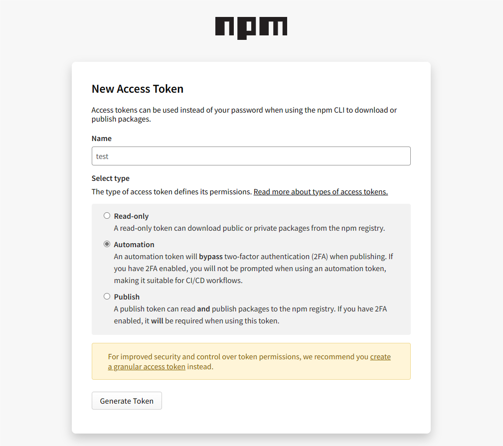

# karin的ts插件开发模板

## 前言

ts插件的开发较为繁琐，但请不要着急，容我娓娓道来~  

- `TypeScript` 开发编写 -> 编译为`js` -> 发布 `npm` 包 -> 用户安装

## 克隆模板仓库

> 需要注意 请先安装`karin`哦~

打开[模板仓库](https://github.com/KarinJS/karin-plugin-template-ts)

点击`Use this template`或`使用此模板`按钮，创建自己的仓库。


填写仓库名称，描述，选择是否公开。


```bash
# 请改成你自己的仓库 注意！ 现在是克隆成单独的文件夹 而不是以前一样作为插件
git clone https://github.com/karinjs/karin-plugin-template-ts.git
```

## 安装开发依赖

```bash
pnpm install
```

## 开始你的开发

```bash
npx karin ts
```

```bash
# 编译
npm run build
# or
pnpm build
```

## 配置基本秘钥

> 需要1个基本的`npm`秘钥

1. 前往[npmjs](https://www.npmjs.com/)注册账号
2. 注册完成点击`右上角头像` -> `Access Tokens` -> `Granular Access Token` -> `Classic Token`
3. 填写`token`的`name`，选择`Automation`，如下图
  
4. 随后点击`Generate Token`即可
5. 打开[Github](https://github.com)，请自行登录账号。
6. 打开你刚才`Fork`的仓库，点击`Settings(设置)` -> `Secrets and variables(机密和变量)` -> `actions(操作)`
7. 选择`Repository secrets(仓库机密)`，点击`New repository secret(新建仓库机密)`
8. `Name *(名称 *)` 输入 `NPM_TOKEN` ， `Secret *(机密 *)` 输入你刚才得到的`npm`秘钥，随后保存即可。
9. 允许`github-actions`发起`pr`，打开仓库主页，点击`Settings(设置)` -> `Actions(操作)` -> 勾选`Allow GitHub Actions to create and approve pull requests(允许 GitHub Actions 创建和批准拉取请求)` -> `Save(保存)`

这里的步骤很长，请仔细认真一步步来，`npm`的秘钥，获取一次之后，多个仓库都可以重复使用，建议`npm`账户打开`2FA`

## 设置npm包名称

> [!IMPORTANT]
> 对于包名，请自行查看`npm`上是否已经冲突，`npm`的包名必须是唯一的。

你需要更改以下这些选项:

- `package.json`:
  - `name`: 改成npm包名，请注意使用`全部小写`
  - `author`: 改成你的名字，需要英文哦
  - `description`: 改成插件描述
  - `homepage`: `npm`显示的主页
  - `bugs.url`: 反馈bug
  - `repository`: 指定项目的代码存储库地址
- `.github/workflows/release-please.yml`:
  - 修改其中的`package-name`，注意，这里需要和上面`package.json`的一致。

> 对于更多选项，请自行查看注释。

## 推送

> [!IMPORTANT]
> 编写好代码之后，正常`git pull`，随后等待几秒钟，合并`pr`即可。

利用`Gihub`提供的`actions`来编译，推送`npm`。

## 安装发布的包

```bash
# 在karin根目录执行
pnpm add package.name -w
```
