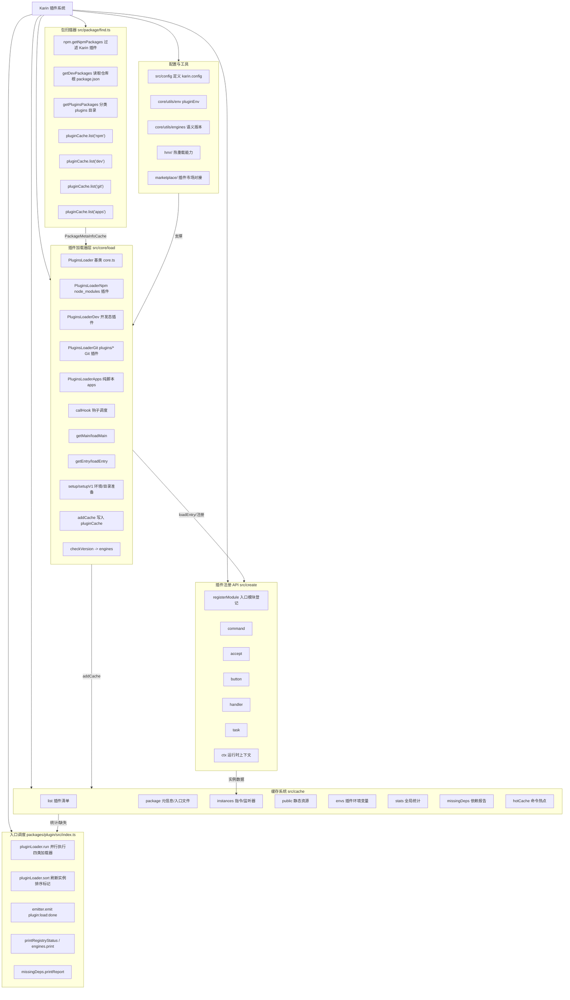

# Karin 插件系统架构（Mermaid）

## 核心流程

1. **扫描阶段**：`packageFinder` 收集四类插件源，结果写入 `pluginCache.list` 供后续加载器复用。
2. **上下文准备**：各 `PluginsLoader*` 加载器通过 `readPkg` 与 `getConfig` 读取配置，使用 `setup/setupV1` 搭建目录、静态资源与环境变量。
3. **加载执行**：`loadMain` 解析并执行 `KARIN_PLUGIN_INIT`，`loadEntry` 逐个导入入口文件并调用 `registerModule` 完成指令、监听器等注册。
4. **收尾动作**：统一写入 `pluginCache.package`、更新统计信息，触发钩子 `load:done` 并在 `pluginLoader.run` 中广播 `plugin:load:done` 事件、打印注册概览。

## 关键数据流

- **Package 元信息**：由扫描阶段生成 `PackageMetaInfoCache`，贯穿整条加载链，用于定位物理路径与 `package.json`。
- **插件实例注册**：入口模块经 `registerModule` 写入 `pluginCache.instances`，支撑命令、按钮、处理器等运行时调度。
- **环境与静态资源**：`pluginEnv` 与 `pluginCache.public` 共同确保插件所需的 env 变量与公开目录在加载时就绪。
- **可观测性**：`pluginCache.missingDeps`、`pluginCache.hotCache`、`printRegistryStatus` 提供缺失依赖报告与热点使用统计，便于运营与调试。

## 延伸能力

- **热重载**：`hmr/` 模块基于缓存与入口映射可选择性重载单个插件或文件。
- **插件市场**：`marketplace/` 负责外部插件源对接，为加载器补充上游安装管道。
- **工具链整合**：`create/` 导出的构建 API（如 `command`、`task`）与 `config/` 的类型守卫，使插件开发沿用 TypeScript 语义并获得类型提示。
