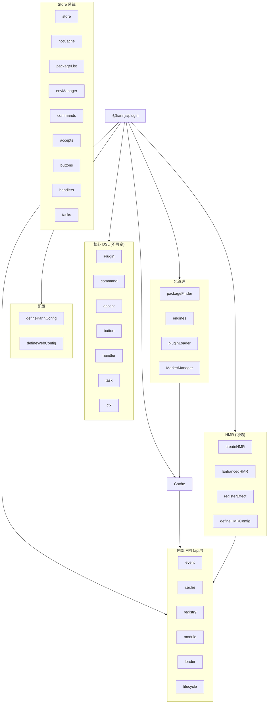

# Karin 插件系统架构

## 设计原则

1. **核心 API 稳定**：`Plugin, accept, button, command, handler, task, ctx` 这些 API 永远不变
2. **最小化导出**：减少 API 暴露面积，提高可维护性
3. **HMR 可选**：热更新作为独立模块，可完全移除
4. **缓存标准化**：统一缓存接口，支持自定义实现

## 模块结构

```text
src/
├── index.ts          # 主入口，统一导出
├── create/           # 核心 DSL API (Plugin, command, accept 等)
├── cache/            # 缓存系统
├── api/              # 内部 API (event, cache, registry, module, loader, lifecycle)
├── config/           # 配置管理 (defineKarinConfig, defineWebConfig)
├── core/             # 核心引擎和加载器
├── package/          # 包扫描器
├── marketplace/      # 插件市场
├── hmr/              # 热重载（可选模块）
├── types/            # 类型定义
└── utils/            # 工具函数
```

## API 层次

### 第一层：核心 DSL（插件开发者使用）

```ts
import { Plugin, command, accept, button, handler, task, ctx } from '@karinjs/plugin'

// 这些 API 永远不变，插件开发者主要使用这些
command(/hello/, async () => {
  await ctx().reply('world')
})
```

### 第二层：配置 API

```ts
import { defineKarinConfig, defineWebConfig } from '@karinjs/plugin'

// 用于配置文件
export default defineKarinConfig({
  // ...
})
```

### 第三层：Store 系统

```ts
import { store, hotCache, packageList, envManager } from '@karinjs/plugin'

// 访问已注册的插件
store.get('command')   // 所有命令插件
store.get('handler')   // 所有处理器
store.stats()          // 统计信息

// 热点缓存
hotCache.query('#help')  // 查询热点命令

// 包列表
packageList.get('npm')   // npm 类型插件包

// 环境变量
envManager.get('my-plugin')  // 获取插件环境变量
```

### 第四层：内部 API（高级用法）

```ts
import { api } from '@karinjs/plugin'

// 底层 API，通过命名空间访问
api.event.emit('plugin:load:done', { pkg: 'my-plugin', registered: 5 })
api.registry.sort()
api.loader.loadFile('/path/to/file.ts')
```

### 第五层：HMR（可选，开发环境）

```ts
import { createHMR, registerEffect, defineHMRConfig } from '@karinjs/plugin'

// 热重载相关，生产环境可完全移除
const hmr = createHMR({ paths: ['./src'] })
await hmr.start()
```

## 架构图



## 核心流程

1. **扫描阶段**：`packageFinder` 收集四类插件源（npm/dev/git/apps）
2. **加载阶段**：`pluginLoader` 通过各加载器导入插件入口文件
3. **注册阶段**：DSL API 自动将插件注册到 `pluginCache`
4. **运行阶段**：事件触发时，从缓存中查找匹配的插件执行

## 关键数据流

```
插件文件 → pluginLoader.loadFile → DSL API → pluginCache → 事件匹配 → 执行回调
```

## HMR 独立化

HMR 模块设计为完全可选：

- 生产环境可通过 tree-shaking 移除
- 开发者可以自己实现热更新系统
- 缓存接口标准化，便于外部实现

```ts
// 使用内置 HMR
import { createHMR } from '@karinjs/plugin'
const hmr = createHMR({ paths })
await hmr.start()

// 或者自己实现
import { pluginCache, api } from '@karinjs/plugin'
// 监听文件变化
// pluginCache.unregisterByFile(path)
// api.loader.loadFile(path, { force: true })
// api.registry.sort()
```

## 迁移指南

如果你之前使用了一些已移除的 API，请参考以下迁移：

| 旧 API | 新 API |
|--------|--------|
| `import { event } from '@karinjs/plugin'` | `import { api } from '@karinjs/plugin'; api.event` |
| `import { registry } from '@karinjs/plugin'` | `import { api } from '@karinjs/plugin'; api.registry` |
| 直接访问内部模块 | 通过 `api` 命名空间统一访问 |

注意：为了向后兼容，直接导入 `event, cache, registry, module, loader, lifecycle` 仍然有效。
